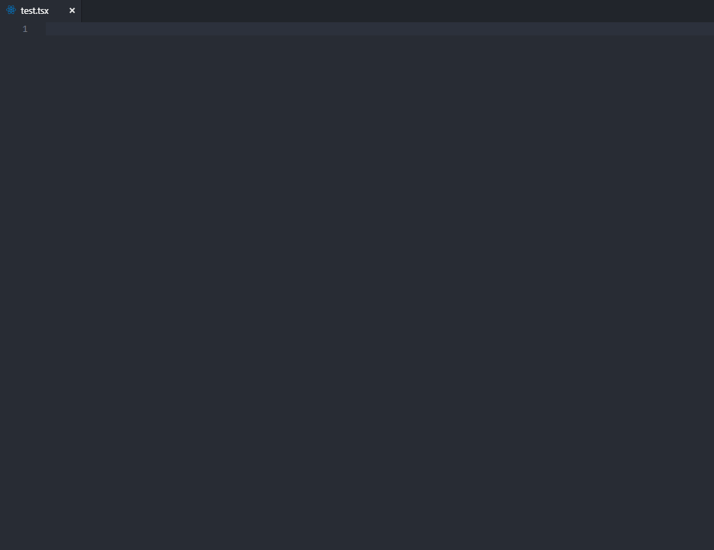

# React

## typescript&react 代码片段

暂时不考虑片段的通用性，先偏向自己团队的风格，后续再更新

## 安装

扩展面板搜索 ts-react-snippets 进行安装

## 片段生效文件类型

-   TypeScript (.ts)
-   TypeScript React (.tsx)

## 支持的片段

| 指令  | 生成的内容                  |
| ----- | --------------------------- |
| tsrcc | 初始化一个 class 组件       |
| tsrfc | 初始化一个 function 组件    |
| tsrrc | 初始化一个 react&redux 组件 |
| tssa  | 初始化 actions              |
| tssr  | 初始化 reducer              |
| tsse  | 初始化 epic                 |
| tsst  | 初始化 actionTypes          |

## 使用

### 初始化一个 class 组件

### 初始化一个 function 组件

### 初始化一个 react&redux 组件

### 初始化 actions

### 初始化 reducer

### 初始化 epic

### 初始化 actionTypes

